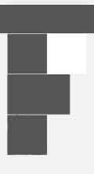
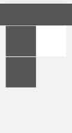

# Developing:

`git clone ...`

`cd ...`

`rake`

`go to 0.0.0.0:4000`

This Rake task runs the Jekyll server, as well as watching for changes to SCSS.

  

# To add a new project to the site:

## 1. Choose a layout (1, 2 or 3):

&nbsp;&nbsp;
&nbsp;&nbsp;

  

## 2. Make your images:

`homepage.jpg`: 355x355px // project image which appears on homepage

`homepage_m.jpg`: 168x168px // for small screens

`header.jpg`: 1200x360px // hero image which appears at top of project page

`header_m.jpg`: 600x180px // for small screens

`img1`: 750x750px // first project page image

`img1_m`: 600x600px // for small screens

`img2`: 1590x1008px // second project page image

`img2_m`: 600x380px // for small screens

`img3`: 750x750px // third project page image

`img3_m`: 600x600px // for small screens

  

## 3. Make a file called 'index.html' with these contents:

`---`

`layout: project_template_one (or _two or _three)`

`title: The Project Title`

`index: 6 (this number describes where the project appears on the homepage)`

`client: The Client Name`

`description: The project description`

`link: a URL`

`linktext: Link text for the URL above`

`---`

  

## 4. Put everything (images and index.html) in a folder

The name of the folder will be the name of the URL the project is served at. E.g. a folder named *my-new-project* will be served at *http://www.suki-rai.com/my-new-project*

  

## 5. Commit and upload everything to Github. Jekyll will rebuild the site automatically.

  

### LICENSING

The site design and code are licensed separately under Creative Commons and MIT licenses. Other stuff is licensed under its own terms (fonts, JavaScript libraries) or used under a "fair use" policy (client project images). See [http://suki-rai.com/license](http://suki-rai.com/license) for more details.

  

### TESTING

There's a basic visual test setup which you can use to compare visual output from your local Jekyll server and the live code on Github Pages. It uses Wraith from the BBC: [https://github.com/BBC-News/wraith
](https://github.com/BBC-News/wraith)

To use it:

`cd wraith`

`bundle`

`rake`

This will run Phantom, take screenshots of both local and remote sites (defined in */wraith/configs/config.yaml*) and save them in */wraith/shots*. Open the gallery.html file in that directory to inspect the results of your test. You may need to install Phantom, and Imagemagick, in which case I recommend Homebrew.